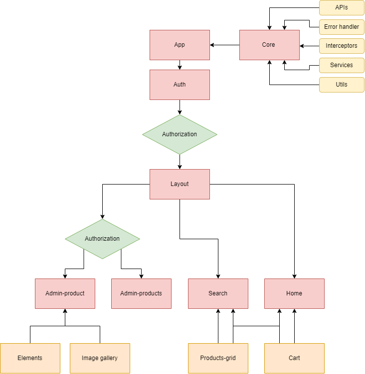

# About The Project

This is a fake shopping website based on https://github.com/recruit-case/Frontend-Starter


## Architecture

Here is a brief diagram of this project. 



### Scenario

After you run the project, you will see the `Auth` page. 
In this page you will see a list of `users`. Now, you have to choose if you want to login as a `customer` or an `admin`.
As a `customer`, first page you see is the `home` page. In this page, you can see some `products` and the `cart`. You can add products to the cart. 
If you search using the search input, you will be redirected to the `search` page. The `search` page is similar to the `home` page.

But if you login as an `admin`, you will see all the products in the `admin-products` page. 
In this page, you can create, edit, or remove a product. Creation and update of the products will be handled in the `admin-product` page.
In this page, you can create or edit `name`, `description`, `discount`, and `price` of the product.

## Deployment

### Back-end
First, you need to install the modules and run the backend using `npm start` inside the `backend` folder.
It will create your backend at `localhost:8080`.

```bash
  npm install && npm start
```


### Front-end
Exciting part! You just need to install the modules and run the front-end using `npm start` inside `frontend` folder. 
Make sure you have already the latest version of `angular cli`.


```bash
  npm install -g @angular/cli
  npm install && npm start
```

